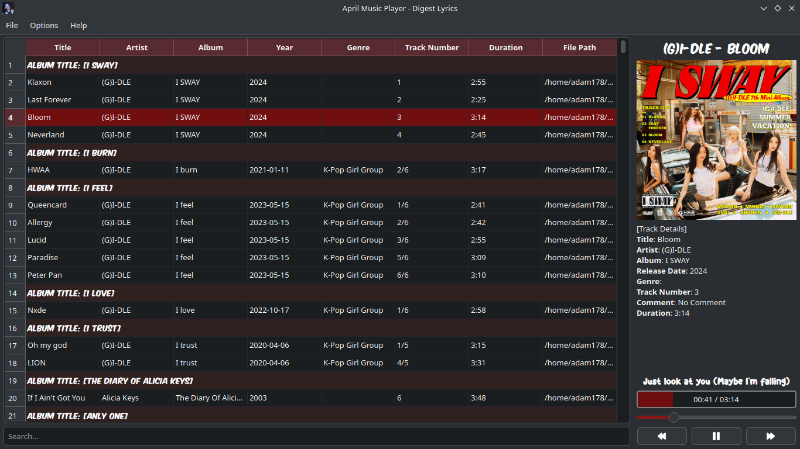
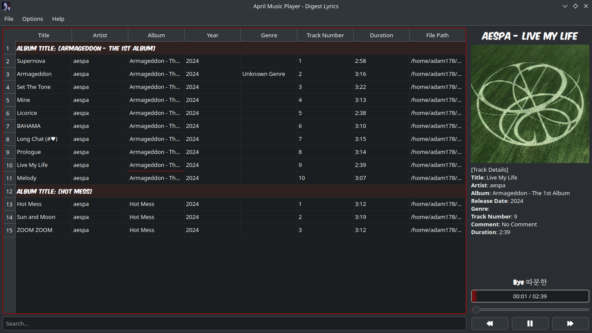
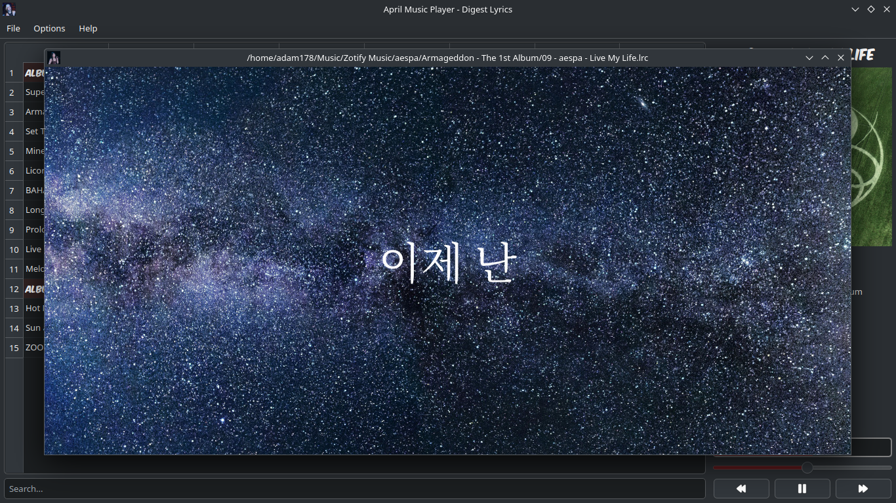

# april-music-player

Music player with lyric syncing and note-taking features for lyric memorization. (Note-taking is currently not available.)

### Installation

- Installer for windows is available in the releases section.
- To run the project with Python, clone or download the repository:
    
    `git clone https://github.com/amm926616/april-music-player.git` or download the repo.

- Go inside the folder.
    
- (Optional) Create a virtual environment:

    `python -m venv .venv && source .venv/bin/activate`
    
- Install the required modules:

    `pip install -r requirements.txt`
    
- Run the main script:
    
    `python main.py`

- Later, maybe you can create your own shortcut or script to automate the running process.     

### Keyboard Shortcuts

- **Left Arrow, Right Arrow, Spacebar**: Seek backward, seek forward, and play/pause, respectively.
- **Ctrl + L**: Activate LRC display, or double-click the progress bar.
- **Ctrl + S**: Focus and place cursor on search bar.
- **Ctrl + Q**: This shortcut quits the program. The program runs in the background even if you close the main window. 
- **In LRC view**:
    - **F**: Toggle full-screen mode.
    - **D**: Go to the start of current lyric.
    - **Up Arrow, Down Arrow**: Seek to the previous or next lyric line.

#### screenshots

### ctrl l to activate lrc display or you can double click progress bar.

### pressing f activates full screen mode.

