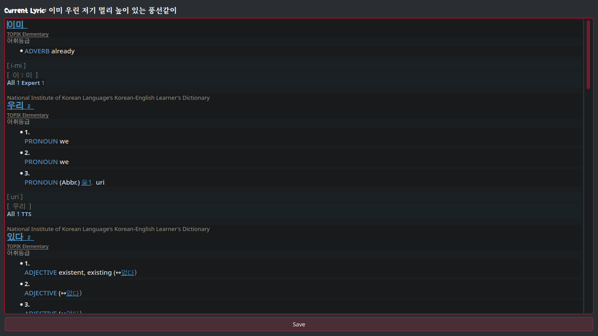

# april-music-player

Music player with lyric syncing and note-taking features for lyric memorization. (Currently the player is only in looping mode for one song.)

### For music and lrc files
Before using the player, you'll need to download your songs and lyrics in advance. I use Zotify to download songs from Spotify, and for LRC lyrics files, I recommend using LrcGet, Syrics on your laptop, or SongSync on Android. There are also various websites where you can download music with embedded metadata and lyrics.

- https://github.com/zotify-dev/zotify
- https://github.com/tranxuanthang/lrcget
- https://github.com/akashrchandran/syrics
- https://github.com/Lambada10/SongSync

### Features to be implemented
- own art style for icon image
- Song metadata editabled
- delete song in the ui
- smart playing mode
  - resume where you left
  - random mode
  - play next song in album
- it will be better to have global shortcut keys
- Lyrics texts could be better with stoke. 
- Live background changing of of lrc display.
- User Customizable fonts
 
### Installation

- An installer for Windows is available in the releases section. However, since I don't use Windows, creating an installer can be tedious. So, I will only create an installer for major updates. I recommend running the program directly from the Python file for the best experience, as daily updates and bug fixes will be released frequently.

- To run the project with Python, clone or download the repository:
    
    `git clone https://github.com/amm926616/april-music-player.git` or download the repo.

- Go inside the folder.
    
- (Optional) Create a virtual environment:

    `python -m venv .venv && source .venv/bin/activate`
    
- Install the required modules:

    `pip install -r requirements.txt`
    
- Run the main script:
    
    `python main.py`

- Later, maybe you can create your own shortcut or script to automate the running process.     

### Keyboard Shortcuts

- **Left Arrow, Right Arrow, Spacebar**: Seek backward, seek forward, and play/pause, respectively.
- **Ctrl + L**: Activate LRC display, or double-click the progress bar.
- **Ctrl + S**: Focus and place cursor on search bar.
- **Ctrl + Q**: This shortcut quits the program. The program runs in the background even if you close the main 
window. 
- **In LRC view**:
    - **F**: Toggle full-screen mode.
    - **D**: Go to the start of current lyric.
    - **Up Arrow, Down Arrow**: Seek to the previous or next lyric line.
    - **E**: To activate Note Book
- **In Lyrics Notebook**:
  - **Ctrl + S**: To save written text.
  - **Esc**, **Ctrl + W**, **Alt + F4**: To exit without saving.

## Screenshots

### Save Album Art to disk

### **Ctrl + L** to activate lrc display or you can double click progress bar.

### Pressing F activates full screen mode.

### Take Your Notes In Each Lyric, a helpful feature to study vocabulary from songs.

Also, try out my 'Personal Dictionary' to collect vocabulary. It features a search system that shows words with similar syllables, mimicking how neurons connect in the brain. 

